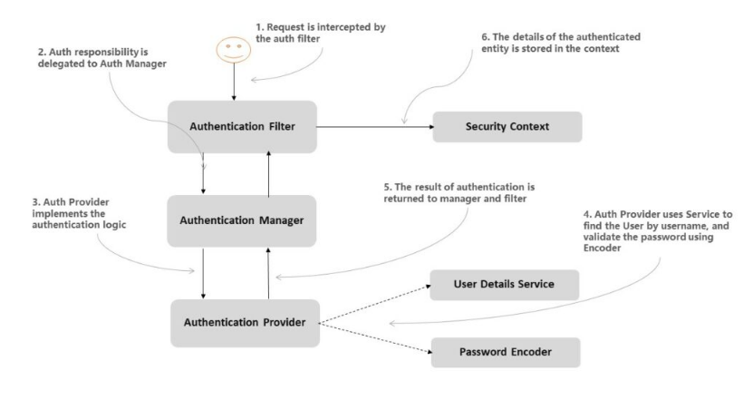

# Spring Security Fundamentals:

## Preconditions:

- Module # 1 - Managing Users
```shell
git checkout spring-security-1-managing-users
```
Theoretic Part:
<br/>
<ul>
<u>Authentication</u>
<li>Authentication used to verify the identity of a registered user.</li>
<li>Authentication is the process of verifying credentials: user ID (name, email address, phone number) and password.</li>
<li>Authentication types: HTTP Basic, CERT, JWT (OAuth2)</li>
<li>https never using with HttpBasic</li>
<li>HttpHeader Key: Autherization, Value: Basic Base64-encoded pwd by default (if make decode we obtain user: uuid-pwd)</li>
</ul>
<ul>
<u>Authorization</u>
<li>Authorization determines whether the verified person has access to certain resources: information, files, database.</li>
<li>The authentication factors required for authorization may vary depending on the level of security.</li>
<li>Authorization may be : webapps/HttpFilters and non-webapps/Aspect</li>
<li>Aspect can be with webapps</li>
</ul>
<ul>
<u>Glossary</u>
<li>Encoding: math function - no need secret - that transform input to output using defining rules (Base64 rule for example)</li>
<li>Encryption: transform input to output but if we want to get input from output we are need secret</li>
<li>Hash-Function: transform input to output, but we're never going from output to input (this is impossible). If we lost output, fraud never obtain output. MD5 - deprecated has collision</li>
<li>Authority: You have (read, write, delete) - other words authorities it is an action</li>
<li>Role: You are (admin, user, guest) - other words roles it is badge</li>
<li>GrantedAuthority: interface ( Authortity + Role ) - what is user allow to do</li>
<li>UserDetailsService - Core interface in Spring Security framework, which is used to retrieve the user's authentication and authorization information. It is a contract between Spring Security framework and application. This interface has only one method named loadUserByUsername() that return UserDetails</li>
<li>UserDetails - Provides core user information.</li>
<li>InMemoryUserDetailsManager - implements UserDetailsService to provide support for username/password based authentication that is stored in memory.</li>

UserDetails user = User.builder().username("user").password("{bcrypt}$2a$10$GRLdNijSQMUvl/au9ofL.eDwmoohzzS7.rmNSJZ.0FxO/BTk76klW").roles("USER").build();
UserDetails admin = User.builder().username("admin").password("{bcrypt}$2a$10$GRLdNijSQMUvl/au9ofL.eDwmoohzzS7.rmNSJZ.0FxO/BTk76klW").roles("USER", "ADMIN").build(); 
return new InMemoryUserDetailsManager(user, admin);

<li>PasswordEncoder - PasswordEncoder that is defined in the Spring Security configuration to encode the password. In this example, the passwords are encoded with the bcrypt algorithm because we set the PasswordEncoder as the password encoder in the configuration. BCryptPasswordEncoder / NoOpPasswordEncoder</li>
<li>Realm - an object that manages a set of users, credentials, roles, and groups</li>
</ul>
Coding Parts
<br/>
1. Configure H2 TCP server:

```java
@Bean(initMethod = "start", destroyMethod = "stop")
public Server inMemoryH2DatabaseServer()throws SQLException{
    return Server.createTcpServer("-tcp","-tcpAllowOthers","-tcpPort","9092");
}
```

2. Configure H2 Datasource and JPA:

```yaml
spring:
  datasource:
    url: jdbc:h2:mem:spring-security
    driver-class-name: org.h2.Driver
    username: sa
    password:
  jpa:
    hibernate:
      ddl-auto: none
    open-in-view: false
    show-sql: true
    properties:
      hibernate:
        format_sql: true
  sql:
    init:
      schema-locations: classpath:database/schema.sql
      data-locations: classpath:database/data.sql
```

3. Configure Remote Connection to H2 Database via Database Tools

```java
jdbc:h2:tcp://localhost:9092/mem:spring-security
```
- Module # 2 - Custom Authentication
```shell
git checkout spring-security-2-custom-authentication
```
Theoretic Part:
<br/>
<u>Glossary</u>
<ul>
<li>FilterChain is an object provided by the servlet container to the developer giving a view into the invocation chain of a filtered request for a resource.</li>
<li>AuthenticationFilter delegate to AuthenticationManager (one) that find appropriate AuthenticationProviders (many). If AP need credentials that it use UserDetailsService and validate pwd use PasswordEncoder. If succeed request return and AuthenticationFilter save it into SecurityContext</li>
<li>AuthenticationManager processes an Authentication request. Attempts to authenticate the passed Authentication object, returning a fully populated Authentication object (including granted authorities) if successful.</li>
<li>Authentication Represents the token for an authentication request or for an authenticated principal once the request has been processed by the AuthenticationManager.authenticate(Authentication) method.</li>
<li>AuthenticationProvider Indicates a class can process a specific Authentication implementation.</li>
<li>SecurityContext Interface defining the minimum security information associated with the current thread of execution.</li>
</ul>

Coding Parts:
<br/>
Preconditions related to module 2:
```yaml
secret:
  key: secret
```
First of all we are need to provide bean named SecurityFilterChain into Spring Security Configuration class beside using deprecated class WebSecurityConfigurerAdapter (extends WebSecurityConfigurerAdapter)
HttpSecurity allows configuring web based security for specific http requests.
```java
@Configuration
public class SecurityConfiguration {

    private final CustomAuthenticationFilter customAuthenticationFilter;

    @Bean
    public SecurityFilterChain securityFilterChain(HttpSecurity httpSecurity) throws Exception {
        return httpSecurity
                .addFilterAt(customAuthenticationFilter, UsernamePasswordAuthenticationFilter.class)
                .authorizeRequests()
                .anyRequest()
                .authenticated()
                .and()
                .build();
    }

}
```
Adds the Filter at the location of the specified Filter class. For example, if you want the filter CustomFilter to be registered in the same position as UsernamePasswordAuthenticationFilter, you can invoke:
addFilterAt(new CustomFilter(), UsernamePasswordAuthenticationFilter.class)
```java
@RequiredArgsConstructor

@Component
public class CustomAuthenticationFilter extends OncePerRequestFilter {

    private final CustomAuthenticationManager customAuthenticationManager;

    @Override
    protected void doFilterInternal(HttpServletRequest request, HttpServletResponse response, FilterChain filterChain) throws ServletException, IOException {
        filterChain.doFilter(request, response);
    }

}
```
And also we are need to add AuthenticationManager implementation
```java
@Component
public class CustomAuthenticationManager implements AuthenticationManager {

    private final CustomAuthenticationProvider customAuthenticationProvider;

    @Override
    public Authentication authenticate(Authentication authentication) throws AuthenticationException {
        if (customAuthenticationProvider.supports(authentication.getClass())) {
            return customAuthenticationProvider.authenticate(authentication);
        }
        throw new BadCredentialsException("CustomAuthenticationManager Exception");
    }

}
```
AuthenticationProvider implementation
```java
@Component
public class CustomAuthenticationProvider implements AuthenticationProvider {

    @Value("${secret.key}")
    private String secretKey;

    @Override
    public Authentication authenticate(Authentication authentication) throws AuthenticationException {
        CustomAuthentication customAuthentication = (CustomAuthentication) authentication;

        String headerKey = customAuthentication.getKey();
        if (secretKey.equals(headerKey)) {
            return new CustomAuthentication(true, null);
        }

        throw new BadCredentialsException("CustomAuthenticationProvider Exception");
    }

    @Override
    public boolean supports(Class<?> authentication) {
        return CustomAuthentication.class.equals(authentication);
    }

}
```
- Module # 3 - Custom Authentication with Users
```shell
git checkout spring-security-3-custom-authentication-with-users
```
Updated Components:

<br/>
CustomAuthenticationFilter
```java
@Component
public class CustomAuthenticationFilter extends OncePerRequestFilter {

    private final CustomAuthenticationManager customAuthenticationManager;
    private static final String KEY_HEADER = "key";

    @Override
    protected void doFilterInternal(HttpServletRequest request, HttpServletResponse response, FilterChain filterChain) throws ServletException, IOException {
        String key = String.valueOf(request.getHeader(KEY_HEADER));

        String[] retrieveCredentials = retrieveCredentials(request);
        String username = retrieveCredentials[0];
        String password = retrieveCredentials[1];

        CustomAuthentication customAuthentication = new CustomAuthentication(false, key, username, password);

        Authentication authenticate = customAuthenticationManager.authenticate(customAuthentication);
        if (authenticate.isAuthenticated()) {
            SecurityContextHolder.getContext().setAuthentication(authenticate);
            filterChain.doFilter(request, response);
        }
    }

    private String[] retrieveCredentials(HttpServletRequest request) {
        String authorizationHeader = String.valueOf(request.getHeader(HttpHeaders.AUTHORIZATION));

        authorizationHeader = authorizationHeader.trim();
        byte[] base64Token = authorizationHeader.substring(6).getBytes(StandardCharsets.UTF_8);
        byte[] decoded = Base64.getDecoder().decode(base64Token);
        String token = new String(decoded, StandardCharsets.UTF_8);

        return token.split(":");
    }

}
```
CustomAuthenticationProvider
```java
@Component
public class CustomAuthenticationProvider implements AuthenticationProvider {

    @Value("${secret.key}")
    private String secretKey;

    private final JpaUserDetailsService userDetailsService;

    @Override
    public Authentication authenticate(Authentication authentication) throws AuthenticationException {
        CustomAuthentication customAuthentication = (CustomAuthentication) authentication;

        String headerKey = customAuthentication.getKey();
        if (secretKey.equals(headerKey)) {
            UserDetails userDetails = userDetailsService.loadUserByUsername(customAuthentication.getUsername());
            if (userDetails.getPassword().equals(customAuthentication.getPassword())) {
                return new CustomAuthentication(true, null, userDetails.getUsername(), userDetails.getPassword());
            }
        }

        throw new BadCredentialsException("CustomAuthenticationProvider Exception");
    }

    @Override
    public boolean supports(Class<?> authentication) {
        return CustomAuthentication.class.equals(authentication);
    }

}
```
- Module # 4 - Multiple Authentication Providers
```shell
git checkout spring-security-4-multiple-authentication-providers
```
Decription:
<br/>
It is possible to have multiple custom authentication providers for a single custom authentication manager. 
So, it is enough one of the providers to give a go, but at the same time if one of them throws AuthenticationException it's a no go. 
If an authentication provider cannot decide, either its supports() method should return false or the authenticate() method should return null.
<br/>
Updated Components:
<br/>
SecurityConfiguration:
```java
@RequiredArgsConstructor
@Configuration
public class SecurityConfiguration {

    private final CustomAuthenticationFilter customAuthenticationFilter;

    @Bean
    public SecurityFilterChain securityFilterChain(HttpSecurity httpSecurity) throws Exception {
        return httpSecurity
                .httpBasic()
                .and()
                .addFilterBefore(customAuthenticationFilter, BasicAuthenticationFilter.class)
                .authorizeRequests()
                    .anyRequest()
                    .authenticated()
                .and()
                .build();
    }

    @Bean
    public PasswordEncoder passwordEncoder() {
        return NoOpPasswordEncoder.getInstance();
    }
}
```
CustomAuthenticationFilter:
```java
@RequiredArgsConstructor
@Slf4j
@Component
public class CustomAuthenticationFilter extends OncePerRequestFilter {

    private final CustomAuthenticationManager customAuthenticationManager;
    private static final String KEY_HEADER = "key";

    @Override
    protected void doFilterInternal(HttpServletRequest request, HttpServletResponse response, FilterChain filterChain) throws ServletException, IOException {
        try {
            String key = request.getHeader(KEY_HEADER);

            String[] retrieveCredentials = retrieveCredentials(request);
            String username = retrieveCredentials[0];
            String password = retrieveCredentials[1];

            validateRequirements(key, username, password);

            CustomAuthentication customAuthentication = new CustomAuthentication(false, key, username, password);

            Authentication authenticate = customAuthenticationManager.authenticate(customAuthentication);
            if (authenticate.isAuthenticated()) {
                SecurityContextHolder.getContext().setAuthentication(authenticate);
                filterChain.doFilter(request, response);
            } else {
                response.setStatus(HttpServletResponse.SC_UNAUTHORIZED);
            }
        } catch (AuthenticationException e) {
            log.error(e.getMessage());
            filterChain.doFilter(request, response);
        }
    }

    private String[] retrieveCredentials(HttpServletRequest request) {
        String authorizationHeader = request.getHeader(HttpHeaders.AUTHORIZATION);

        authorizationHeader = authorizationHeader.trim();
        byte[] base64Token = authorizationHeader.substring(6).getBytes(StandardCharsets.UTF_8);
        byte[] decoded = Base64.getDecoder().decode(base64Token);
        String token = new String(decoded, StandardCharsets.UTF_8);

        return token.split(":");
    }

    private static void validateRequirements(String key, String username, String password) {
        if (key == null || username == null || password == null) {
            throw new BadCredentialsException("CustomAuthenticationFilter exception");
        }
    }
}
```
CustomAuthenticationManager:
```java
@RequiredArgsConstructor
@Component
public class CustomAuthenticationManager implements AuthenticationManager {

    private final List<CustomAuthenticationProvider> customAuthenticationProviders;

    @Override
    public Authentication authenticate(Authentication authentication) throws AuthenticationException {
        for (CustomAuthenticationProvider customAuthenticationProvider : customAuthenticationProviders) {
            if (customAuthenticationProvider.supports(authentication.getClass())) {
                authentication = customAuthenticationProvider.authenticate(authentication);
            }
        }
        return authentication;
    }
}
```
CustomAuthenticationProvider:
```java
public interface CustomAuthenticationProvider extends AuthenticationProvider {
    @Override
    default boolean supports(Class<?> authentication) {
        return CustomAuthentication.class.equals(authentication);
    }
}
```
KeyCustomAuthenticationProvider implementation:
```java
@Order(1)
@Component
public class KeyCustomAuthenticationProvider implements CustomAuthenticationProvider {
    @Value("${secret.key}")
    private String secretKey;

    @Override
    public Authentication authenticate(Authentication authentication) throws AuthenticationException {
        CustomAuthentication customAuthentication = (CustomAuthentication) authentication;
        String headerKey = customAuthentication.getKey();
        if (secretKey.equals(headerKey)) {
            return new CustomAuthentication(true, null, customAuthentication.getUsername(), customAuthentication.getPassword());
        }
        throw new BadCredentialsException("KeyCustomAuthenticationProvider exception");
    }
}
```
UsernameAndPasswordCustomAuthenticationProvider implementation:
```java
@RequiredArgsConstructor
@Order(2)
@Component
public class UsernameAndPasswordCustomAuthenticationProvider implements CustomAuthenticationProvider {
    private final JpaUserDetailsService userDetailsService;

    @Override
    public Authentication authenticate(Authentication authentication) throws AuthenticationException {
        CustomAuthentication customAuthentication = (CustomAuthentication) authentication;
        UserDetails userDetails = userDetailsService.loadUserByUsername(customAuthentication.getUsername());
        if (userDetails.getPassword().equals(customAuthentication.getPassword())) {
            if (customAuthentication.isAuthenticated()) {
                return customAuthentication;
            }
            return new CustomAuthentication(true, null, userDetails.getUsername(), userDetails.getPassword());
        }
        throw new BadCredentialsException("UsernameAndPasswordCustomAuthenticationProvider exception");
    }
}
```